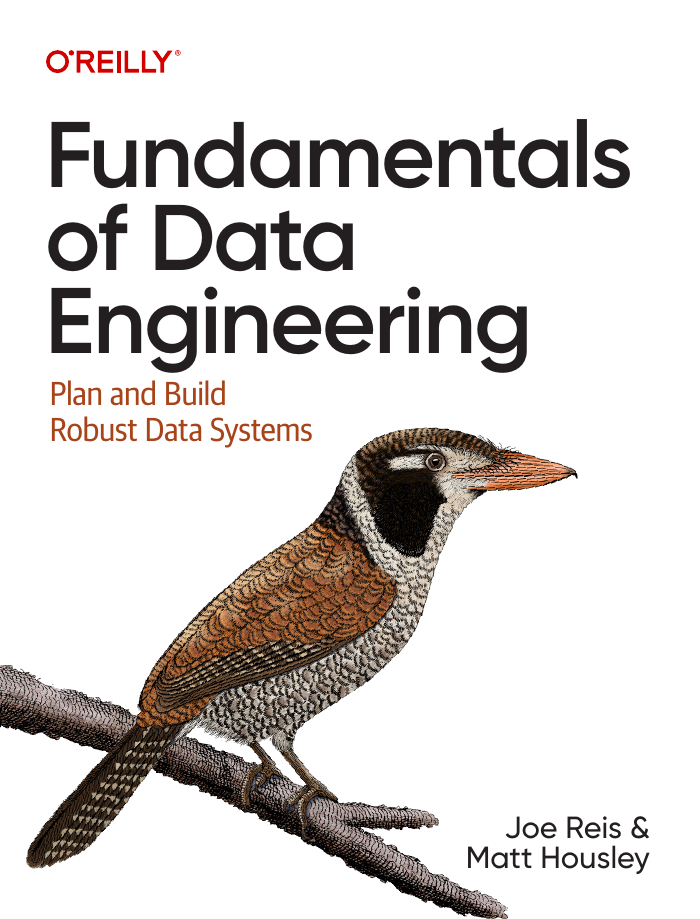
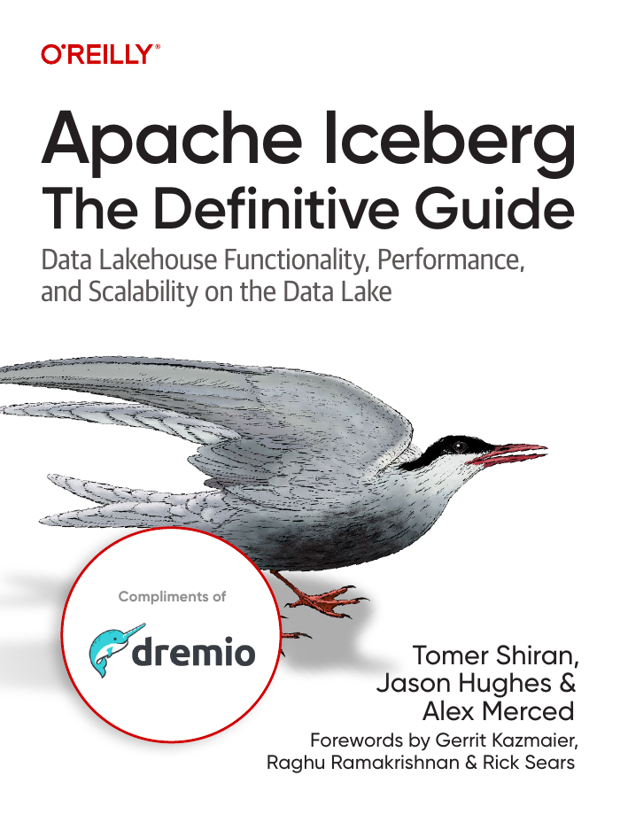
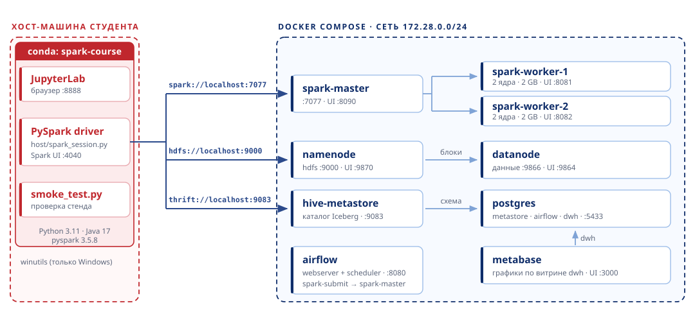
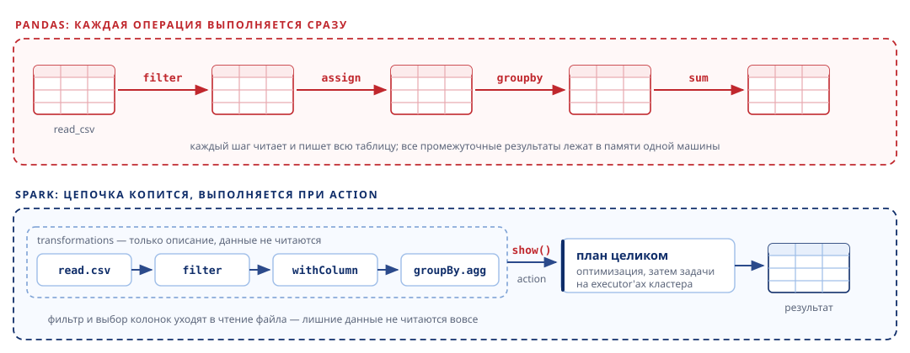
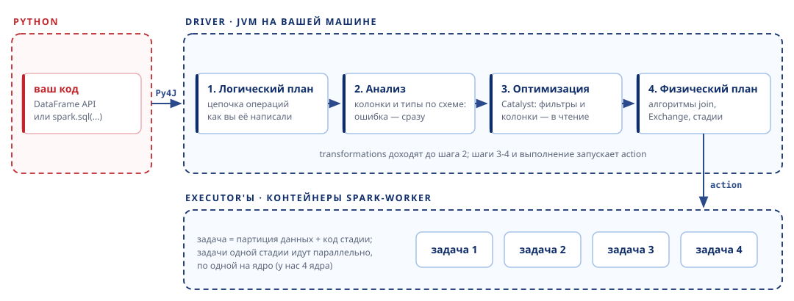
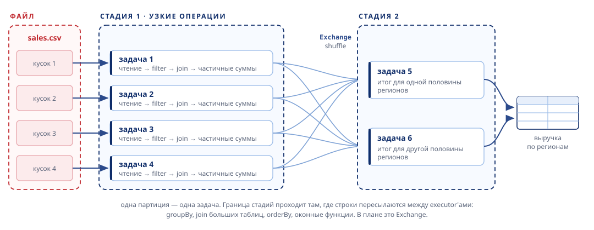

<!-- _class: title -->
<!-- _paginate: false -->
<!-- _footer: "" -->

 

# Инженерная аналитика больших данных: Spark, Iceberg, HDFS

## Мини-курс · занятие 1 — стенд курса и Spark DataFrame API

|  |  |
|---|---|
| Преподаватель | Константин Гаврилов |
| Индустриальный партнёр | Digital Future Systems (ООО «ДФС») |
| ВУЗ | Пермский кампус Высшей школы экономики |
| Программа | магистратура «Бизнес-аналитика», 2 курс |
| Период | осень 2026 |

---

<!-- _class: book -->



## Fundamentals of Data Engineering

*Joe Reis, Matt Housley · O'Reilly, 2022*

* Жизненный цикл данных: генерация → хранение → приём → обработка → отдача
* «Подводные течения»: управление данными, безопасность, оркестрация, DataOps
* Как выбирать технологии под задачу, а не собирать зоопарк модных инструментов

**Зачем нам:** общая рамка, в которую укладывается весь курс. Читать первой — она объясняет, зачем вообще нужны Iceberg, Spark и Airflow по отдельности.

---

<!-- _class: book -->


## Изучаем Spark: молниеносный анализ данных

*Х. Карау, Э. Конвински, П. Венделл, М. Захария · ДМК Пресс, 2015*

* Модель вычислений: RDD, трансформации и действия, ленивые вычисления
* Как задание превращается в стадии и задачи и распределяется по кластеру
* Кеширование, партиционирование, shuffle — откуда берётся скорость и где теряется

**Зачем нам:** объясняет движок изнутри. Издание по Spark 1.x, поэтому код на RDD устарел — мы пишем на DataFrame и SQL, но модель выполнения с тех пор не изменилась.

---

<!-- _class: book -->



## Apache Iceberg: The Definitive Guide

*Tomer Shiran, Jason Hughes, Alex Merced · O'Reilly, 2024*

* Устройство метаданных: снапшоты, манифесты, списки манифестов
* Эволюция схемы и партиционирования без переписывания данных
* Каталоги, обслуживание таблиц, работа с Iceberg из Spark

**Зачем нам:** основная книга по формату таблиц. Главы про метаданные и снапшоты закрывают вторую половину курса.

---

<!-- _class: book -->


## Data Engineering Design Patterns

*Bartosz Konieczny · O'Reilly, 2025*

* Паттерны приёма, преобразования и проверки качества данных
* Идемпотентность, дедупликация, обработка опоздавших записей
* Организация хранения, версионирование и обратная засыпка таблиц

**Зачем нам:** сборник готовых решений для практических заданий — что делать, когда источник прислал дубли или данные приехали задним числом.

---

<!-- _class: lead -->

# Занятие 1. Стенд курса и Spark DataFrame API

## Поднимаем стенд, затем учимся работать с данными на Spark

---

<!-- _class: theory -->

## Чему научимся на курсе

* Проектировать **аналитический слой на Iceberg**: таблицы, схемы, эволюция, снапшоты
* Писать распределённые преобразования на **Spark** и понимать, что происходит с данными
* Понимать разделение **данные ↔ каталог ↔ вычисления** и почему оно так устроено
* Оркестрировать регулярные расчёты в **Airflow**
* Доводить результат до ML-модели и витрины в **Postgres**

> Работаем не в песочнице на одном ноутбуке, а на уменьшенной копии реального стека:
> отдельное хранилище, отдельный каталог, отдельный вычислительный кластер.

---

<!-- _class: theory -->

## HDFS: одна файловая система на много машин

Файлы стенда лежат не на диске вашей машины, а в **HDFS** — распределённой файловой
системе Hadoop. Устройство простое:

* файл режется на **блоки** и раскладывается по **DataNode**'ам;
* каждый блок хранится в нескольких копиях — репликах (на учебном стенде одна:
  DataNode всего один);
* **NameNode** помнит, из каких блоков состоит файл и где эти блоки лежат, — сами данные
  через него не идут, клиент забирает блоки у DataNode напрямую;
* адрес файла выглядит как `hdfs://namenode:9000/warehouse/demo.db/hello/...`.

Главное для нас: **файл в HDFS пишется один раз и не меняется на месте**.
Изменить строку внутри файла нельзя — можно только записать рядом новый файл.

---

<!-- _class: theory -->

## Почему нужен table format

Каталог файлов в HDFS — ещё не таблица. Без отдельного формата таблицы:

* нет **атомарности**: читатель видит половину записанных файлов
* нет **истории**: нельзя прочитать данные «как было вчера»
* **эволюция схемы** ломает старые файлы
* список файлов приходится получать обходом директорий — медленно

**Apache Iceberg** добавляет над файлами слой метаданных: список файлов, схему, статистику
и журнал снапшотов. Транзакция = переключение указателя на новый снапшот.

Указатель на текущий снапшот хранит **каталог** — в нашем стенде это Hive Metastore.

---

<!-- _class: theory -->

## Архитектура стенда



Driver живёт на **вашей** машине, executor'ы — в контейнерах; данные они читают из HDFS.

---

<!-- _class: theory -->

## Кто за что отвечает

| Что | Кто отвечает | Где смотреть |
|---|---|---|
| **Данные** таблиц (parquet + метаданные Iceberg) | HDFS: namenode + datanode | `/warehouse`, UI :9870 |
| **Каталог**: какие таблицы есть и где их снапшот | Hive Metastore, схема в Postgres | thrift :9083 |
| **Вычисления** над данными | Spark: master + 2 worker'а | UI :8090 |
| **Расписание** регулярных расчётов | Airflow (LocalExecutor) | UI :8080 |
| **Витрина** для отчётности | Postgres, база `dwh` | `postgres:5433` |

Удалили строку из Postgres — потеряли **каталог**, но не данные. Удалили `/warehouse` —
потеряли данные, а каталог будет ссылаться в пустоту.

---

<!-- _class: theory -->

## Как вы подключаетесь к стенду

```python
import sys
sys.path.append("/путь/к/iceberg-course-infra/host")
from spark_session import get_spark

spark = get_spark("lab-01")
spark.sql("CREATE NAMESPACE IF NOT EXISTS iceberg.demo")
spark.sql("CREATE TABLE IF NOT EXISTS iceberg.demo.t (id BIGINT) USING iceberg")
spark.stop()
```

`get_spark()` сам задаёт master, адрес driver'а, jar-пакеты Iceberg, каталог `iceberg`
и ресурсы — руками эти настройки прописывать не нужно.

---

<!-- _class: theory -->

## Кластер у каждого свой — и он небольшой

* Весь стенд работает **на вашей машине**: два воркера по 2 ядра и 2 ГБ, всего **4 ядра**
* Одно приложение по умолчанию забирает **весь кластер**: 2 executor'а по 2 ядра и 2 ГБ.
  Вторая сессия (другой ноутбук или DAG в Airflow) ждёт в очереди, пока первая не завершится
* Закончили работу — **`spark.stop()`**: иначе кластер занят до перезапуска ядра ноутбука
* Кто сейчас занимает ваш кластер, видно на http://localhost:8090
* В простое стенд занимает около **4 ГБ** оперативной памяти (из них ~1 ГБ — Metabase),
  каждый executor — ещё примерно 2.4 ГБ. Отсюда требование 16 ГБ RAM и привычка
  закрывать лишние сессии
* Записываете в Postgres — в URL пишите `postgres:5433`, а не `localhost`:
  подключается **executor** внутри сети Docker, а не ваш ноутбук
* Читаете свой файл — сначала положите его в HDFS: executor'ы не видят диск хоста

---

<!-- _class: practice -->

## Шаг 0. Скачать репозиторий

1. Запустить программу `Git Bash` через меню «Пуск»
2. Перейдите на свободный диск `D:` командой `cd d:/`
3. Загрузите репозиторий `git clone https://github.com/konstgav/spark-course-hse.git`

---
<!-- _class: practice -->

## Шаг 1. Windows: освободить диск `C:`

Стенд займёт около **20 ГБ**: образы Docker (~10 ГБ) и окружение conda с кэшами
(ещё 8–10 ГБ). По умолчанию всё это ложится на `C:`, поэтому переносим **заранее** —
перекладывать скачанное дольше, чем сразу указать `D:`.

1. Docker Desktop → Settings → Resources → Advanced → **Disk image location** →
   указать `D:\DockerData` → Apply & restart
2. Создать каталоги и перенести туда TEMP и кэш pip — в него распаковываются wheels-пакеты,
   один `pyspark` больше 300 МБ:
   `New-Item -ItemType Directory -Force D:\temp, D:\pip-cache`
   `setx TEMP D:\temp` · `setx TMP D:\temp` · `setx PIP_CACHE_DIR D:\pip-cache`
3. **Открыть новый терминал**: `setx` действует только на процессы, запущенные после него

Linux и macOS этот шаг пропускают.

---

<!-- _class: practice -->

## Шаг 2. hosts-файл и winutils

1. Дописать строку в `C:\Windows\System32\drivers\etc\hosts` (Блокнот от имени
   администратора), на Linux и macOS — в `/etc/hosts`:
   `127.0.0.1 namenode datanode hive-metastore postgres`
2. Windows — поставить winutils, без него Hadoop на Windows не стартует:
   `cd spark-course-hse`
   `powershell -ExecutionPolicy Bypass -File host\install_winutils.ps1 -Prefix D:/hadoop`
3. Linux с включённым `ufw`: `sudo ufw allow from 172.28.0.0/24`

Имена контейнеров сохраняются внутри metastore, поэтому должны резолвиться одинаково
и в Docker, и на хосте. Без hosts-файла запись в HDFS просто зависнет, без winutils
сессия упадёт на `Did not find winutils.exe`.

---

<!-- _class: practice -->

## Шаг 3. Окружение `spark-course`

Версии не «желательные», а обязательные: pyspark 3.5 не работает с Python 3.12 и Java 21.

1. Windows — ставим Miniconda сразу на `D:`:
   `powershell -ExecutionPolicy Bypass -File host\install_miniconda.ps1 -Prefix D:\miniconda3`
2. Linux / macOS: `bash host/install_miniconda.sh`
3. Открыть новый терминал и проверить:
   `conda activate spark-course`, затем `python --version` → 3.11.x и `java -version` → 17.x

Окружения и кэш пакетов conda держит внутри каталога установки, поэтому установка
на `D:` уносит туда и их — отдельно переносить ничего не нужно.

---

<!-- _class: practice -->

## Шаг 4. Поднять стенд

1. Перейти в каталог репозитория: `cd spark-course-hse`
2. Собрать и запустить: `docker compose up -d --build`
3. Проверить состояние: `docker compose ps -a`

Первый запуск занимает **5–15 минут**: качаются образы, собираются `iceberg-course/spark`
и `iceberg-course/airflow`.

**Ожидаемый результат:** все сервисы `Up`, сервисы с healthcheck — `(healthy)`,
а `airflow-init` — `Exited (0)`: это одноразовая инициализация, так и должно быть.

---

<!-- _class: practice -->

## Шаг 5. Проверить стенд с хоста

```bash
cd host
python smoke_test.py
```

Скрипт по порядку проверяет hosts-файл, запись и чтение Iceberg-таблицы в HDFS,
распределение задач по обоим воркерам, Python UDF, `toPandas()` и запись в `dwh` по JDBC.

**Ожидаемый результат** — последняя строка `OK: стенд работает`.

Файлы таблицы видно в http://localhost:9870 → *Utilities → Browse the file system* →
`/warehouse/demo.db/hello`.

---

<!-- _class: lead -->

# Часть 2. Spark DataFrame API

## Как Spark превращает ваш код в распределённое вычисление

---

<!-- _class: theory -->

## DataFrame = строки + схема

**DataFrame** — таблица: набор строк и **схема**, то есть имена и типы колонок.

| колонка | тип |
|---|---|
| `event_ts` | `TIMESTAMP` |
| `store_id` | `INT` |
| `operation_type` | `STRING` |
| `price_paid_kop` | `BIGINT` |

Откуда берётся:

```python
spark.createDataFrame([Row(store_id=1, city="Пермь")])     # из списка
spark.createDataFrame(pandas_df)                            # из pandas
spark.read.csv("hdfs://namenode:9000/raw/sample/sales.csv") # из файлов
spark.table("iceberg.retail.stores")                        # из таблицы
```

---

<!-- _class: theory -->

## Что происходит в `spark.read.csv(...)`

1. **Список файлов** по пути. Нет файла или прав — ошибка сразу
2. **Схема**: из заголовка и `schema=...` или, с `inferSchema=True`, Spark **прочитает
   весь файл**, чтобы угадать типы — это отдельное задание на кластере
3. Возвращается DataFrame: **ссылка на данные + схема**. Самих данных в нём нет

```python
SCHEMA = "event_id BIGINT, event_ts TIMESTAMP, store_id INT, price_paid_kop BIGINT, ..."
sales = spark.read.csv(path, header=True, schema=SCHEMA)
```

Схему задают явно: угадывание дорогое и ошибается — `customer_id` окажется `int`, а номера перерастут его через год.

---

<!-- _class: theory -->

## Transformations и actions

| вид | примеры | что делает |
|---|---|---|
| **transformation** | `select`, `withColumn`, `filter`, `groupBy().agg()`, `join`, `orderBy` | возвращает **новый DataFrame** — описание вычисления |
| **action** | `show`, `count`, `collect`, `toPandas`, `write` | строит план и **выполняет** его на кластере |

```python
revenue = (sales.filter(F.col("operation_type") == "SALE")      # мгновенно
                .withColumn("price_rub", F.col("price_paid_kop") / 100)
                .groupBy("store_id").agg(F.sum("price_rub")))    # мгновенно
revenue.show()                                                   # вот здесь работа
```

---

<!-- _class: theory -->

## Ленивые вычисления



Зная цепочку **целиком**, Spark выбрасывает лишнее ещё до чтения данных и не хранит
промежуточные таблицы.

---

<!-- _class: theory -->

## От кода к плану



Python только **описывает** вычисление, считает JVM. Поэтому встроенные функции `F.*` быстрые, а свой код на Python (UDF) медленнее: строки гоняются между JVM и Python.

---

<!-- _class: theory -->

## Как читать `explain()`

```text
HashAggregate(keys=[region], functions=[sum(price_rub)])                  ← 4. итоговые суммы
+- Exchange hashpartitioning(region, 8)                                   ← 3. shuffle: граница стадий
   +- HashAggregate(keys=[region], functions=[partial_sum(price_rub)])    ← 2. частичные суммы
      +- BroadcastHashJoin [store_id], [store_id], Inner                  ← справочник — копией на все executor'ы
         :- Filter (operation_type = SALE) AND (price_paid_kop >= 0)
         :  +- FileScan csv [store_id, operation_type, price_paid_kop]    ← 1. читаются только 3 колонки
         :        PushedFilters: [EqualTo(operation_type,SALE), ...]      ←    фильтр уже при чтении
         +- BroadcastExchange
            +- FileScan csv [store_id, region]
```

* Читается **снизу вверх**: от чтения файлов к результату
* `explain(True)` показывает все этапы: parsed → analyzed → optimized → physical
* `Exchange` = **shuffle** = новая стадия. Чем их меньше, тем быстрее запрос

---

<!-- _class: theory -->

## Партиции, задачи, стадии



CSV и Parquet режутся на куски (**splittable**), а сжатый `.csv.gz` — нет: один файл = одна задача.

---

<!-- _class: theory -->

## Spark UI: где это увидеть

http://localhost:4040 — пока открыта сессия ноутбука (вторая сессия — :4041).

| вкладка | что там |
|---|---|
| **Jobs** | задания: каждое action — одно или несколько заданий |
| **Stages** | стадии: число задач, время, объём shuffle |
| **SQL / DataFrame** | план запроса с числом строк на каждом шаге |
| **Executors** | executor'ы на воркерах, память, упавшие задачи |

Строка прогресса в ноутбуке `[Stage 12:=====>  (3 + 4) / 7]`: в стадии 7 задач,
3 готовы, 4 выполняются — по одной на каждое ядро кластера.

---

<!-- _class: theory -->

## Ошибки Spark: как читать

Ошибка из Python — это `Py4JJavaError` с длинным Java-стектрейсом.

* Ищите строки **`Caused by:`** — настоящая причина обычно в последней из них
* `AnalysisException` — ошибка в коде: нет колонки, неверный тип. Появляется сразу
* Ошибка **при action** — в данных или в ресурсах: смотрите лог задачи в Spark UI
* `Lost task` и повтор — Spark **перезапускает упавшие задачи**. Что задача успела записать наружу, может записаться дважды (занятие 2)
* Executor завершился с кодом **137** или **143** — его убили снаружи, чаще всего за превышение памяти

---

<!-- _class: practice -->

## Шаг 6. Данные для практики — в HDFS

Выборка по сквозной теме курса — один день операций касс сети магазинов (~38 тыс.
строк) и справочники — уже лежит в репозитории, в `data/sample/`.

Executor'ы читают файлы из HDFS, поэтому кладём выборку туда. Из корня репозитория:

```bash
docker compose exec namenode hdfs dfs -mkdir -p /raw
docker compose exec namenode hdfs dfs -put -f /data/sample /raw/
docker compose exec namenode hdfs dfs -ls /raw/sample
```

**Ожидаемый результат:** четыре файла — `sales.csv`, `stores.csv`, `categories.csv`,
`products.csv`. Их же видно в http://localhost:9870 → *Browse the file system* → `/raw/sample`.

---

<!-- _class: practice -->

## Шаг 7. Ноутбук `lab-01-spark.ipynb`

1. `jupyter lab` **из корня репозитория** → `notebooks/lab-01-spark.ipynb`
2. Выполнить разделы 0–7 по порядку: от чтения CSV до записи в Iceberg
3. Держать открытым http://localhost:4040 и смотреть, какие ячейки создают задания
4. Задания 1–4 в конце ноутбука — самостоятельно: оплаты, категории, скидки, чтение плана
5. Последняя ячейка — `spark.stop()`: без неё ядра кластера остаются занятыми

---
## Итоги занятия

* **HDFS** хранит файлы блоками на DataNode'ах; файл пишется один раз и не меняется на месте
* **Iceberg** — слой метаданных над этими файлами: транзакции, история, эволюция схемы
* Стенд — **три независимых слоя**: HDFS (данные), Hive Metastore (каталог), Spark (вычисления)
* Driver PySpark работает **на вашей машине**, вычисления уходят в контейнеры
* DataFrame — **описание** вычисления: transformations ничего не считают, **action** запускает план целиком
* Spark **оптимизирует** план: фильтры и выбор колонок уходят в чтение
* Партиция = задача, **shuffle** (`Exchange`) = граница стадий — видно в `explain()` и Spark UI
