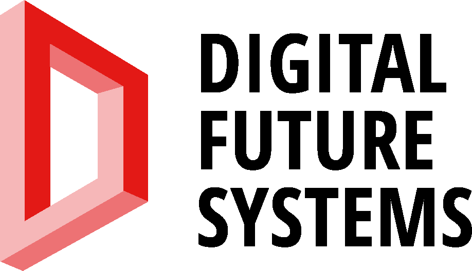
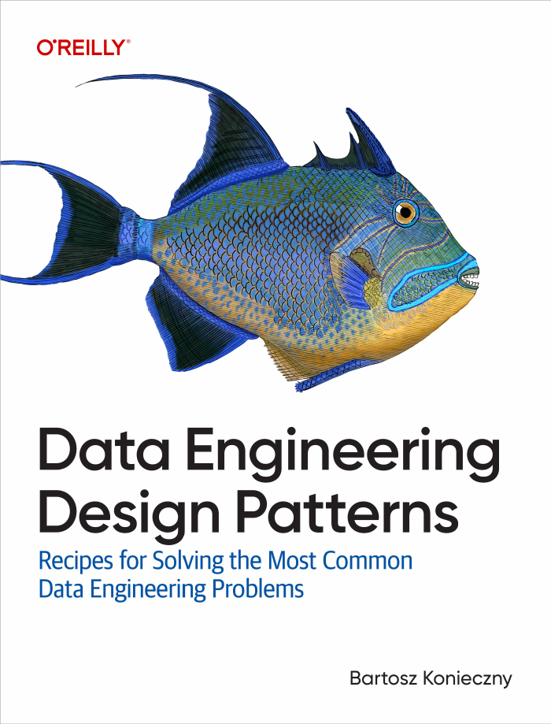

<!-- _class: title -->
<!-- _paginate: false -->
<!-- _footer: "" -->

 

# Инженерная аналитика больших данных: Spark, Iceberg, HDFS

## Мини-курс · занятие 2 — загрузка данных

|  |  |
|---|---|
| Преподаватель | Константин Гаврилов |
| Индустриальный партнёр | Digital Future Systems (ООО «ДФС») |
| ВУЗ | Пермский кампус Высшей школы экономики |
| Программа | магистратура «Бизнес-аналитика», 2 курс |
| Период | осень 2026 |

---

<!-- _class: lead -->

# Занятие 2. Загрузка данных

## Розничная сеть, Airflow и два слоя хранилища: bronze и silver

---

<!-- _class: theory -->

## Кейс: розничная сеть

* ~150 продуктовых магазинов в 15 регионах, от Москвы до Хабаровска
* Кассы **каждый час** выгружают операции в CSV: продажи, отмены, возвраты
* Файл за час — до **~90 МБ, ~1 млн строк**. За 3 дня — 72 файла, 36 млн строк
* Справочники: магазины (город, регион, формат), категории, товары

Задача хранилища: **регулярно** забирать эти файлы, **не терять и не дублировать** данные
и отдавать аналитикам чистую таблицу.

Описание всех полей — `docs/retail-data.md`.

---

<!-- _class: theory -->

## Одна строка — одна позиция чека

| event_id | event_ts | receipt_id | line_no | product_id | operation_type | price_paid_kop | ref_event_id |
|---|---|---|---|---|---|---|---|
| 1001 | 18:02:10 | 555 | 1 | 779 | `SALE` | 28101 | |
| 1002 | 18:02:13 | 555 | 2 | 126 | `SALE` | 10080 | |
| 1007 | 18:03:40 | 555 | 2 | 126 | `CANCEL` | 10080 | 1002 |
| 2031 | *+2 дня* | 912 | 1 | 779 | `RETURN` | 28101 | 1001 |

* `CANCEL` — кассир отменил позицию, пока чек не закрыт
* `RETURN` — покупатель вернул товар позже, новым чеком
* Деньги — в **копейках**, целыми числами: никаких ошибок округления `float`

---

<!-- _class: theory -->

## Источник «грязный» — как в жизни

| что | почему так бывает |
|---|---|
| **дубли** внутри файла | касса повторила отправку после таймаута |
| **повторная отправка** части прошлого часа | источник не уверен, дошёл ли файл |
| **опоздавшие** строки: `event_ts` на 1–3 часа раньше часа файла | офлайн-касса выгрузила чеки, когда появилась связь |
| отрицательная цена, неизвестный магазин, нет товара | ошибки интеграции |

Если просто сложить все файлы, выручка получится **завышенной**, а некоторые продажи будут
посчитаны дважды.

---

<!-- _class: theory -->

## Два слоя: bronze и silver

```
data/retail/sales/sales_<час>.csv
      │   Airflow, каждый час
      ▼
iceberg.retail.sales_bronze    файл как есть + file_hour, source_file, loaded_at
      │   очистка + MERGE INTO
      ▼
iceberg.retail.sales_silver    одна строка = одна операция, отмены учтены
```

* **Bronze** — копия источника. Если в очистке ошибка, её исправляют и пересчитывают
  silver из bronze, не запрашивая файлы заново
* **Silver** — таблица, на которой строится аналитика (занятие 3)

---

<!-- _class: theory -->

## Airflow за 5 минут

**DAG** — описание регулярного процесса на Python: какие шаги, в каком порядке, по какому
расписанию. Airflow сам запускает его и хранит историю запусков.

```python
with DAG(
    dag_id="retail_sales_bronze",
    start_date=pendulum.datetime(2026, 9, 4, 0, tz="Europe/Moscow"),
    end_date=pendulum.datetime(2026, 9, 6, 23, tz="Europe/Moscow"),
    schedule="@hourly",        # один запуск на каждый час
    catchup=True,              # догнать все часы с start_date
    max_active_runs=1,         # строго по очереди
) as dag:
    SparkSubmitOperator(
        task_id="load_hour",
        application="/opt/jobs/retail/load_sales_bronze.py",
        application_args=["{{ data_interval_start.in_timezone('Europe/Moscow').strftime('%Y-%m-%dT%H') }}"],
    )
```

`{{ ... }}` — шаблон: каждый запуск подставляет **свой** час, `2026-09-04T14`.

---

<!-- _class: theory -->

## Что делает шаг `load_hour`

`jobs/retail/load_sales_bronze.py`, по сути четыре строки:

```python
df = (spark.read.csv(f"file:///opt/data/retail/sales/sales_{hour}.csv",
                     header=True, schema=SCHEMA)
      .withColumn("file_hour",   F.to_timestamp(F.lit(hour), "yyyy-MM-dd'T'HH"))
      .withColumn("source_file", F.lit(f"sales_{hour}.csv"))
      .withColumn("loaded_at",   F.current_timestamp()))

df.writeTo("iceberg.retail.sales_bronze").overwritePartitions()
```

* Схема задана явно: Spark не угадывает типы и не читает файл дважды
* Таблица партиционирована по часу файла: `PARTITIONED BY (hours(file_hour))`
* `overwritePartitions()` **заменяет** партицию этого часа, а не дописывает к ней

---

<!-- _class: book -->



## Паттерн Data Overwrite

*Data Engineering Design Patterns, гл. 4 «Idempotency»*

**Проблема:** загрузку за 14:00 запустили дважды — после сбоя или по ошибке. Обычная
дозапись (`append`) удвоит данные этого часа.

**Решение:** загрузка **перезаписывает** свой кусок данных целиком. Каждый запуск за час
14:00 оставляет в таблице ровно один экземпляр файла 14:00.

**Цена:** кусок должен однозначно определяться запуском. У нас это партиция `file_hour`.

---

<!-- _class: theory -->

## Идемпотентность

Операция **идемпотентна**, если повторный запуск даёт тот же результат, что и первый.

* В хранилище всё рано или поздно перезапускают: упал кластер, исправили ошибку, пришёл
  исправленный файл
* Неидемпотентный конвейер после каждого перезапуска требует ручной чистки
* Идемпотентный можно перезапускать кнопкой **Clear** в Airflow без раздумий

Iceberg помогает: каждая запись — **атомарная** транзакция, новый снапшот. Читатель видит
либо старую партицию, либо новую, но никогда не половину.

---

<!-- _class: book -->


## Паттерн Merger

*Data Engineering Design Patterns, гл. 4 «Idempotency»*

**Проблема:** silver пополняется из bronze снова и снова. Одна и та же операция приходит
несколько раз: дубль, повторная отправка, перезапуск. Перезаписать партицию нельзя —
данные одного дня приходят разными файлами.

**Решение:** **слить** новые данные с таблицей по ключу:

```sql
MERGE INTO iceberg.retail.sales_silver t
USING batch_events s
ON t.event_id = s.event_id AND t.event_date = s.event_date
WHEN NOT MATCHED THEN INSERT *
```

Ключа нет — вставить. Ключ есть — ничего не делать (или обновить).

---

<!-- _class: theory -->

## Отмены — тоже через MERGE

Отмена не строка silver, а **изменение** уже существующей продажи:

```sql
MERGE INTO iceberg.retail.sales_silver t
USING batch_cancels c
ON t.event_id = c.sale_event_id          -- sale_event_id = ref_event_id отмены
WHEN MATCHED AND NOT t.is_cancelled THEN UPDATE SET t.is_cancelled = true
```

* Продажа уже в silver — получит флаг, даже если отмена пришла в следующем файле
* Повторный запуск ничего не меняет: `AND NOT t.is_cancelled`
* Файлы в HDFS не изменяются на месте, поэтому Iceberg **переписывает** файлы
  с отменёнными продажами и публикует новый снапшот

---

<!-- _class: practice -->

## Шаг 1. Сгенерировать данные

1. `conda activate spark-course`, перейти в корень репозитория
2. `python generator/generate_retail.py`
3. Через 1–2 минуты появятся `data/retail/dims/*.csv` и 72 файла `data/retail/sales/`
   (~3 ГБ)

Мало места на диске или слабая машина: `python generator/generate_retail.py --scale 0.1`
даёт те же данные в 10 раз меньше.

Откройте один файл продаж в редакторе и найдите `CANCEL`, `RETURN` и пустые `customer_id`.

---

<!-- _class: practice -->

## Шаг 2. Загрузить справочники

1. Открыть Airflow: http://localhost:8080, `admin` / `admin`
2. Найти DAG `retail_dims` (фильтр по тегу `retail`), включить переключателем слева
3. Нажать **▶ Trigger DAG**
4. Дождаться зелёного квадрата `success` (~1 минута)
5. Открыть задачу `load_dims` → **Logs**: в конце лога — число строк в каждом справочнике

Первый запуск Spark из Airflow дольше обычного: скачиваются jar-пакеты Iceberg.

---

<!-- _class: practice -->

## Шаг 3. Запустить загрузку продаж

1. Включить DAG `retail_sales_bronze`. Airflow сразу начнёт догонять 72 часа
2. Открыть **Grid**: каждая колонка — запуск за один час
3. Одна загрузка — 15–30 секунд, все 72 часа — **около 30 минут**. Пока идёт загрузка,
   переходим к ноутбуку
4. Кластер один: пока ноутбук держит ядра, DAG ждёт. Смотрите http://localhost:8090

Не ждите конца загрузки — ноутбук работает с тем, что уже загружено.

---

<!-- _class: practice -->

## Шаг 4. Ноутбук `lab-02-bronze-silver.ipynb`

1. `jupyter lab` из корня репозитория → `notebooks/lab-02-bronze-silver.ipynb`
2. **Bronze:** сколько строк в каждом файле, снапшоты, путешествие во времени
3. **Проблемы источника:** посчитайте дубли, опоздавшие строки, битые записи
4. **Silver:** допишите четыре пропуска `TODO`:
   фильтр битых строк, дедупликация, условие `MERGE`, флаг отмены
5. Проверочная ячейка должна вывести четыре `OK`
6. Выполните шаги silver **ещё раз** — число строк не изменится

---

<!-- _class: practice -->

## Шаг 5. Проверить идемпотентность bronze

1. Airflow → `retail_sales_bronze` → **Grid** → любой зелёный запуск → задача `load_hour`
2. **Clear** → подтвердить. Airflow повторит загрузку этого часа
3. В ноутбуке снова выполните ячейку со снапшотами bronze:
   * появился новый снапшот `overwrite`
   * `total-records` не изменился
4. Когда DAG загрузит все часы — выполните шаги silver ещё раз: добавятся только новые
   операции

---

## Итоги занятия

* **Airflow** запускает загрузку по расписанию, один запуск — один час, `catchup`
  догоняет пропущенное
* **Bronze** — копия источника с метками загрузки, **silver** — чистые данные для аналитики
* **Data Overwrite:** загрузка перезаписывает свою партицию — перезапуск безопасен
* **Merger:** `MERGE INTO` по ключу — дубли и повторы не проходят, отмены обновляют продажи
* Каждое изменение таблицы Iceberg — **снапшот**: история и путешествие во времени

**В следующий раз:** считаем выручку и средний чек, выгружаем витрины в Postgres
и строим дашборд в Metabase.
